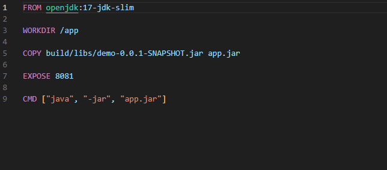
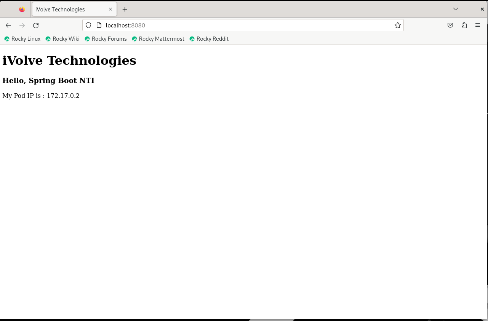

# 🐳 Step 3: Docker & Containerization

This step explains how to containerize your Spring Boot application using Docker and run it .

---

## ✅ Prerequisites

- Docker installed on your machine
- Java JAR file built from the application (`build/libs/*.jar`)
- Dockerfile created (explained below)

---

## 📝 Dockerfile


```dockerfile
FROM openjdk:17-jdk-slim

WORKDIR /app

COPY build/libs/demo-0.0.1-SNAPSHOT.jar app.jar

EXPOSE 8081

CMD ["java", "-jar", "app.jar"]
```

📸 Dockerfile:


---

## 🛠 Build Docker Image

Run this command from the project root:

```bash
docker build -t my-java-application .
```

---

## ▶️ Run the Container

```bash
 docker run -d -p 8080:8081 my-java-app
```

- Port `8081` is exposed in the container
- Port `8080` on your local machine will forward to it

📸 App Running in Container:


---

## 🌐 Access the App in Browser

Once the container is running, go to:

```
http://localhost:8080
```

You should see your Spring Boot application message.

📸 App View in Browser:


---


